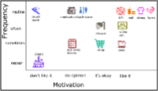
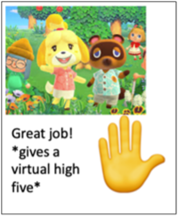
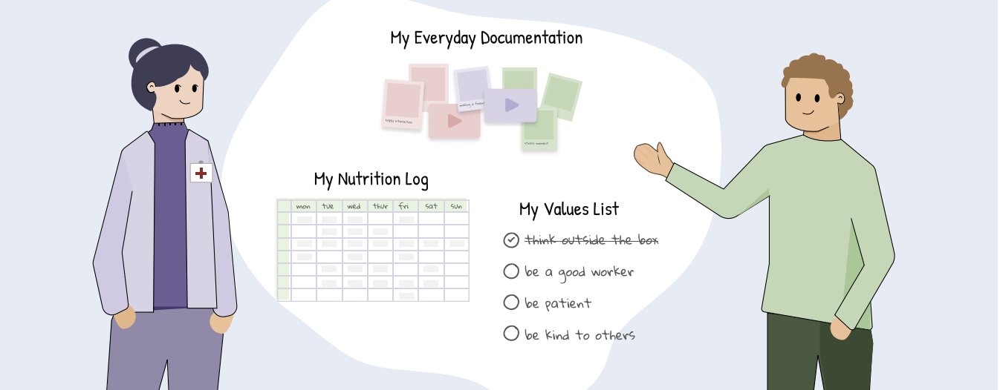
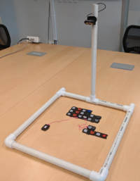
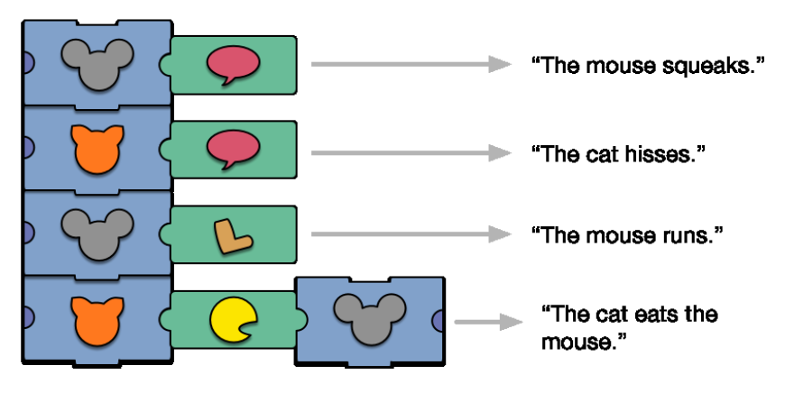
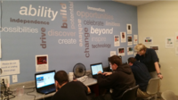
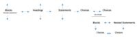
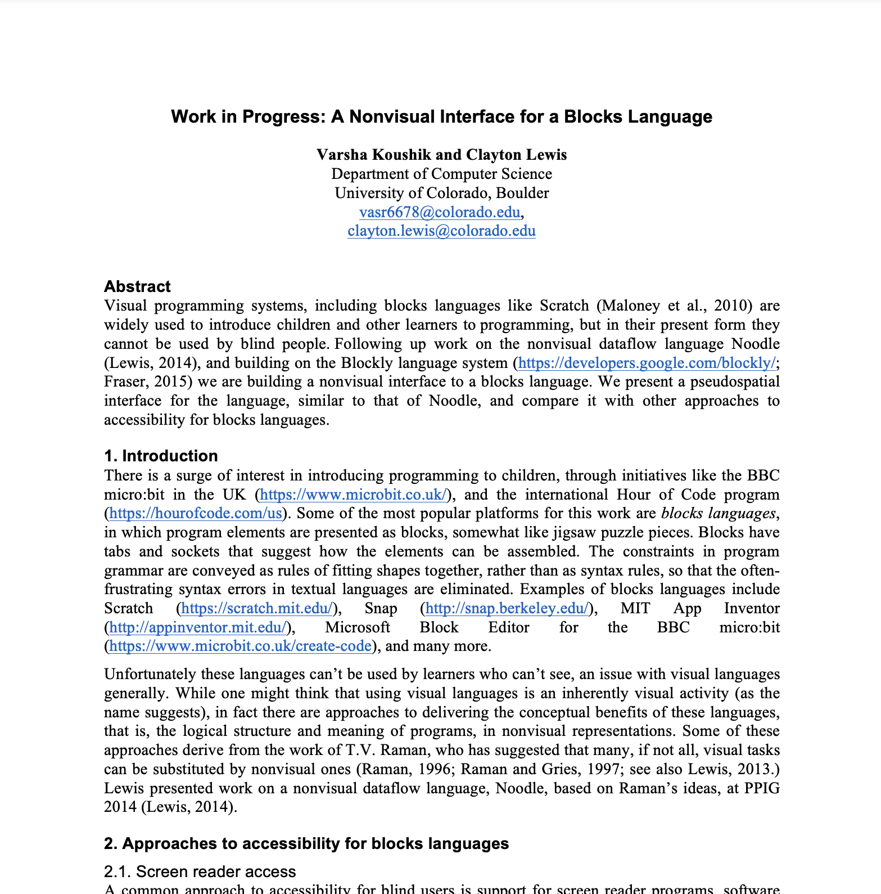
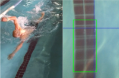

<link rel="stylesheet" href="{{ base_path }}/assets/css/research.css">

# Ongoing Research Projects 
We design interactive systems incorporating flexible and participatory design methods to foster inclusivity in everyday activities. Our design framework prioritizes customization and empowerment, allowing people to become both technology users and creators. We strive towards creating a society that embraces diversity in ability and needs.

## Customizable Prompting To Support Indepedence 
People with cognitive disabilities often face difficulties remembering, learning, and making decisions, impacting their everyday activities. Many individuals rely on assistive technologies to support their daily activities. However, most of these technologies are challenging to use and do not cater to the individual needs of the users – these needs can change every day for the same activity. Smart technologies, like Augmented Reality (AR), can situate visual information in the location of tasks, thereby reducing the amount of contextual switching between tasks and assistive devices. These systems cannot currently customize support for diverse abilities. Through qualitative research, we explore customization in everyday activities to promote independence for people with cognitive disabilities.
### Publications 

[Ability+ Motivation: Understanding Factors that Influence People with Cognitive Disabilities in Regularly Practicing Daily Activities](https://dl.acm.org/doi/abs/10.1145/3587281.3587295)\
**Varsha Koushik** and Shaun Kane \
W4A 2023 **Best Paper Technical Candidate**\
[pdf](/files/ability.pdf) | [ACM DL](https://dl.acm.org/doi/abs/10.1145/3587281.3587295)
 

[Towards augmented reality coaching for daily routines: Participatory design with individuals with cognitive disabilities and their caregivers](https://www.sciencedirect.com/science/article/abs/pii/S107158192200088X)
**Varsha Koushik** and Shaun Kane \
IJHCS 2022 \
[pdf](/files/viz.pdf) | [IJHCS](https://www.sciencedirect.com/science/article/abs/pii/S107158192200088X)
     
## Accesssible Data Visualization
Most conventional forms of data visualizations (bar charts, line graphs, pie charts) and visualization tools (PowerPoint, Tableau, d3) are not accessible to people with intellectual and developmental disabilities (IDD). As the world becomes reliant on fluency in data literacy and data sense-making, it becomes imperative to explore representations accessible to diverse abilities. 
### Publications

[Data, Data, Everywhere: Uncovering Everyday Data Experiences for People with Intellectual and Developmental \ Disabilities](https://dl.acm.org/doi/abs/10.1145/3544548.3581204) \
Keke Wu, Michelle Ho Tran, Emma Petersen, **Varsha Koushik**, and Danielle Albers Szafir \
CHI 2023 \
[pdf](/files/data2.pdf) | [ACM DL](https://dl.acm.org/doi/abs/10.1145/3544548.3581204) | [video](https://www.youtube.com/watch?v=v_je9MjbO0M)

## Collaborative Audio Game Design To Learn Data Sonification 
Collaborative audio games have been helpful in engaging mixed-ability students in STEM topics. As data becomes ubiquitous, we must consider how alternate forms fo data representation can be useful in creating more inclusive means of accessing information. One alternative way of representing data is through sonification. This research focuses on participatory design with teachers and students with visual impairments to learn data sonification through collaborative game design. 

## Understanding Conversational Landscape of Non-Verbal Youth with Autism
Many non-noverbal children with Autism use Augmentative and Alternative Communication Devives (AACs) to communicate. However, it is time consuming to personalize the device configuration for each child and the vocabilary shown is static and does not provide any situational or contextual information. We are working on understanding the converstaional landscape of children and their families to craete alternative interafces for AACs which provide more personalized configuration and contextual information for everyday communication. 

# Past Research Projects 
## Accessible Programming Environments 
Block-based languages like Scratch, Blockly, MIT App Inventor, Snap, etc., are widely popular as a first step towards traditional programming. They offer many benefits, including simpler syntax, easier interactions, and support for creativity and expression through games, animations, stories, and other interactive media. However, these visual-based languages are not accessible to people with visual impairments, and thus, they limit access to introductory programming tools. Furthermore, these introductory programming tools are also not accessible to people with cognitive disabilities. I have created non-visual and tangible interfaces to teach introductory programming concepts through motivating features, such as audio story games and music. I have also conducted qualitative research understanding accessibility needs of people with cognitive disabilities in learning computer science.
### Publications 

[StoryBlocks: A Tangible Programming Game to Create Accessible Audio Stories](https://dl.acm.org/doi/10.1145/3290605.3300722) \
**Varsha Koushik**, Darren Guinness, and Shaun Kane\
CHI 2019 **Best Paper Honorable Mention**\
[pdf](/files/sb.pdf) | [ACM DL](https://dl.acm.org/doi/10.1145/3290605.3300722) | [video](https://www.youtube.com/watch?v=B3plFKpcSKg)

   

[Tangibles + Programming + Audio Stories = Fun](https://dl.acm.org/doi/abs/10.1145/3132525.3134769) \
**Varsha Koushik** and Shaun Kane \
ASSETS 2017 \
[pdf](/files/demo.pdf) | [ACM DL](https://dl.acm.org/doi/abs/10.1145/3132525.3134769)

   

["It Broadens My Mind": Empowering People with Cognitive Disabilities through Computing Education](https://dl.acm.org/doi/abs/10.1145/3290605.3300744) \
**Varsha Koushik** and and Shaun Kane\
CHI 2019 \
[pdf](/files/ts.pdf) | [ACM DL](https://dl.acm.org/doi/abs/10.1145/3290605.3300744) 

[An Accessible Blocks Language: Work in Progress](https://dl.acm.org/doi/abs/10.1145/2982142.2982150) \
**Varsha Koushik** and Clayton Lewis \
ASSETS 2016\
[pdf](/files/pseudo.pdf) | [ACM DL](https://dl.acm.org/doi/abs/10.1145/2982142.2982150)

[Work in Progress: A Nonvisual Interface for a Blocks Language](https://ppig.org/papers/2016-ppig-27th-koushik/) \
**Varsha Koushik** and Clayton Lewis \
VL/HCC PPIG 2016 \
[pdf](/files/ppig.pdf) | [ACM DL](https://ppig.org/papers/2016-ppig-27th-koushik/) 

     

## Accessible Sports Wearable Assistive Technology
Today, blind athletes use a tapper to warn them, when they approach the swimming pool wall. The tapper walks along the pool with a long stick with a tennis ball like round object attached to the end of the stick, and taps on the shoulder or the head when blind swimmers approach the pool wall. This approach is inefficient, and it can be expensive to employ a tapper. We designed a wearable activity tracker called Goby, which is worn on the thigh, and uses a downward facing camera to trace the swimmer’s position in the pool. Goby detects the black T- shaped line and gives audio feedback to warn the swimmer, when they approach the wall, or swim outside their lane.    
### Publications 

[Goby: A Wearable Swimming Aid for Blind Athletes](https://dl.acm.org/doi/abs/10.1145/3132525.3134822) \
Annika Muehlbradt, **Varsha Koushik**, and Shaun K. Kane \
ASSETS 2017 \
CU Boulder New Venture Challenge Finalist 2017: Social Impact \
[pdf](/files/goby.pdf) | [ACM DL](https://dl.acm.org/doi/abs/10.1145/3132525.3134822) | [video](https://www.youtube.com/watch?v=CkWjzh_0ooQ)

